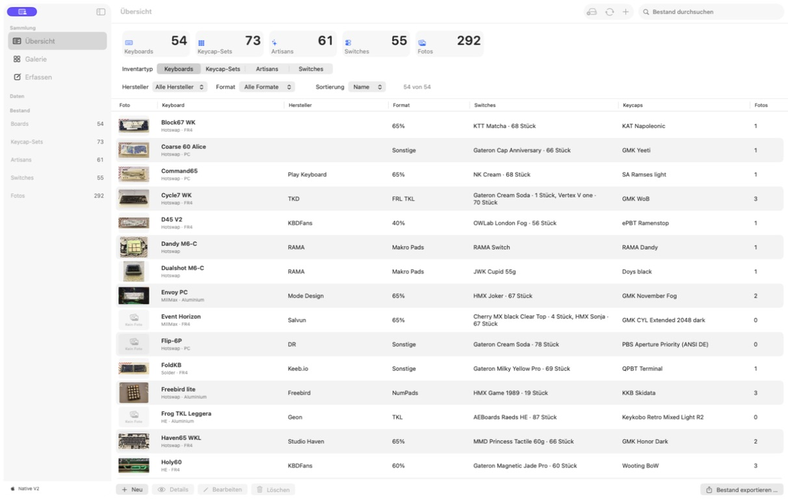
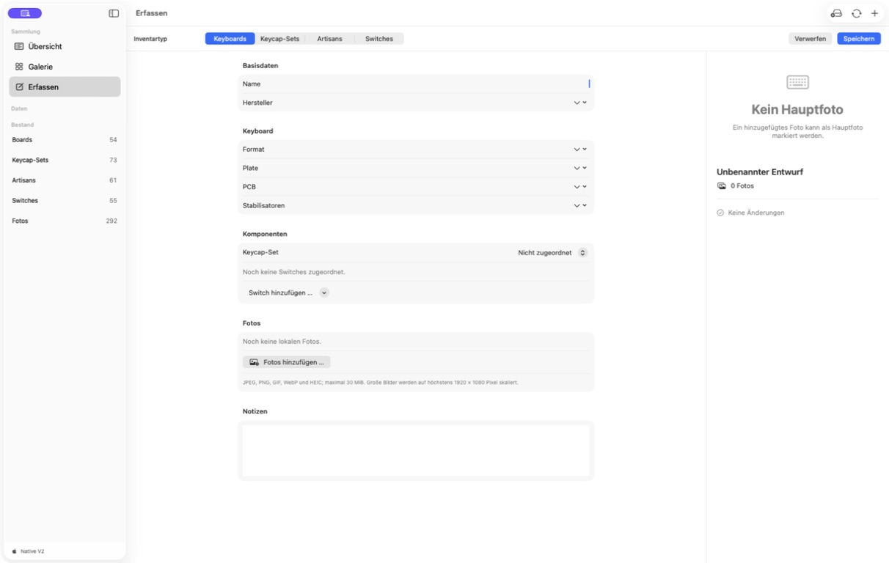
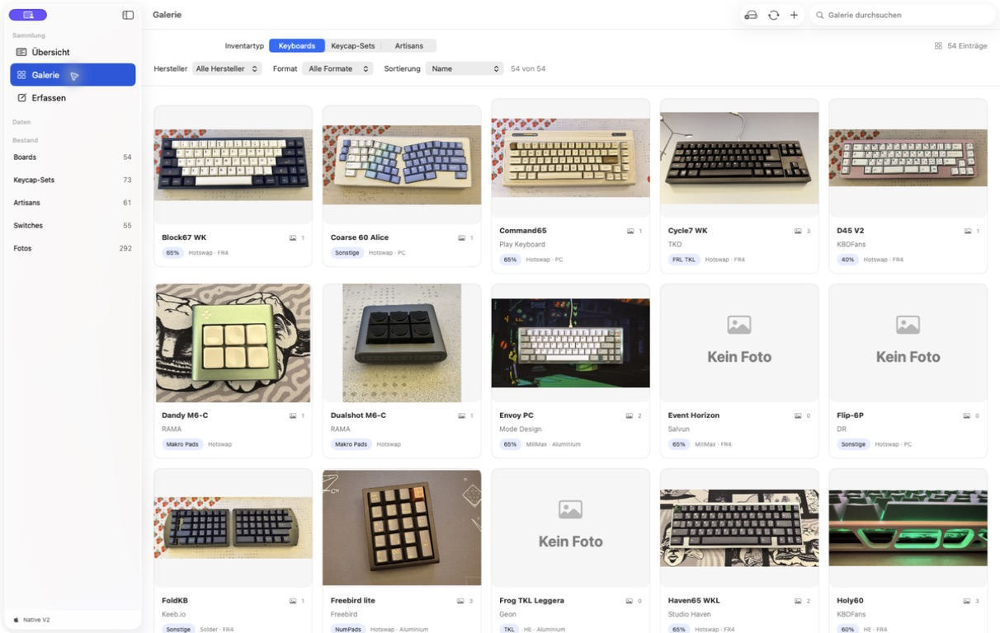

# Keyboard Manager V2 – Fachliche Beschreibung

Stand: 28. August 2026 · Produktversion: 1.1.0

## 1. Zweck und Nutzen

Keyboard Manager V2 ist eine native macOS-Anwendung zur lokalen Verwaltung einer Sammlung mechanischer Tastaturen und ihrer Komponenten. Sie bündelt die Erfassung, Pflege, Suche, Darstellung, Sicherung und Berichterstellung in einer Anwendung.

Die Anwendung richtet sich an Sammlerinnen und Sammler, die ihre Bestände nachvollziehbar dokumentieren möchten: welche Boards vorhanden sind, welche Keycap-Sets, Artisans und Switch-Sets dazugehören, welche Komponenten verbaut sind und welche Fotos den Objekten zugeordnet wurden.

Die Vorgängeranwendung Keyboard Manager V1 bleibt eine unveränderte Referenz. V2 besitzt einen eigenen Datenbereich und verändert weder die V1-Datenbank noch deren Fotoordner.

## 2. Verwaltete Bestandsarten

| Bestandsart | Fachlicher Inhalt |
| --- | --- |
| Keyboards | Board mit Hersteller, Format, Plate, PCB, Stabilisatoren, Keycaps, Switches, Notizen und Fotos |
| Keycap-Sets | Name, Hersteller, Profil, Material, Status, Kits, Quelle, optional montiertes Board und Fotos |
| Artisans | Hersteller, Profil, Material, Status, Tags, optional montiertes Board und Fotos |
| Switch-Sets | Technische Daten, Pin-Typ, Bestand, Installationen auf Boards, verfügbarer Restbestand und Fotos |

Ein Switch-Set kann auf mehreren Boards verbaut sein. Die Anwendung führt die jeweils installierte Menge zentral; der verfügbare Bestand ergibt sich automatisch aus Gesamtbestand minus verbauter Menge und kann nicht negativ werden.

## 3. Startansicht und Bestandsübersicht

Die Sidebar führt zu **Übersicht**, **Galerie**, **Erfassen** und den Datenfunktionen. Die Übersicht zeigt zunächst Kennzahlen für alle vier Bestandsarten und die Zahl der Fotos. Anschließend kann der gewünschte Inventartyp ausgewählt werden.

Suche, typabhängige Filter und Sortierung wirken direkt auf die Tabelle. Für Keyboards werden unter anderem Hersteller und Format gefiltert; bei anderen Inventartypen stehen passende Fachfelder wie Profil, Status, Typ, Betriebskraft oder Pins zur Verfügung. Die Suche berücksichtigt Unterschiede bei Groß- und Kleinschreibung sowie bei diakritischen Zeichen nicht. Trefferzahl, Tabelle und Aktionen aktualisieren sich unmittelbar.

Ein Doppelklick oder die Aktion **Details** öffnet einen vorhandenen Eintrag zur Bearbeitung. Nach Speichern oder bewusstem Verwerfen stellt die Anwendung Auswahl, Filter, Sortierung, Tabellenposition und Fokus wieder her.

*Abbildung 1: Übersicht eines importierten Beispielbestands mit Kennzahlen und der Tabelle für Keyboards.*

## 4. Erfassen und Bearbeiten

Über **Erfassen**, die Toolbar oder `⌘N` wird ein neuer Entwurf angelegt. Je nach gewählter Bestandsart zeigt die Anwendung nur die fachlich passenden Felder. Der Name ist ein Pflichtfeld. Bereits verwendete Hersteller- und Fachwerte können aus Bibliotheken gewählt werden; freie Eingaben bleiben möglich und werden beim Speichern dedupliziert übernommen.

Bei Keyboards lassen sich ein Keycap-Set sowie ein oder mehrere Switch-Sets einschließlich Menge zuordnen. Lokale Bilder können hinzugefügt und eines davon als Hauptfoto markiert werden. Unterstützt werden JPEG, PNG, GIF, WebP und HEIC; pro Datei gelten 30 MiB. Große Bilder werden vor der lokalen Ablage auf höchstens 1.920 × 1.080 Pixel skaliert.

Entwürfe sind vom gespeicherten Bestand getrennt. **Speichern** validiert die Eingaben und schreibt erst dann in den lokalen Bestand. **Verwerfen** verlangt bei Änderungen eine eindeutige Entscheidung. Auch Navigation, Typwechsel und der rote Fensterschalter schützen ungespeicherte Änderungen; „Weiter bearbeiten“ erhält den Entwurf.

*Abbildung 2: Erfassungsmaske für ein Keyboard mit getrennten Bereichen für Basisdaten, Komponenten, Fotos und Notizen.*

## 5. Galerie und Detailansicht

Die Galerie stellt Boards, Keycap-Sets und Artisans als anpassbares Kartenraster dar. Lokale Hauptfotos werden direkt angezeigt; Einträge ohne lokales Bild erhalten einen klaren nativen Leerzustand statt eines künstlich gespeicherten Ersatzbildes. Filter, Suche, Sortierung und Trefferzahl funktionieren analog zur Übersicht.

Ein Klick auf eine Karte öffnet die Großansicht. Dort können Details geprüft, bearbeitet oder nach Bestätigung gelöscht werden. Die Pfeiltasten wechseln innerhalb eines Eintrags durch dessen lokale Fotos; `Esc` schließt die Großansicht. Externe Bildadressen aus einer V1-Übernahme werden nur als solche kenntlich gemacht und nicht automatisch geladen.

*Abbildung 3: Galerie der Keyboards mit Hauptfotos, Kerninformationen und dem sichtbaren Leerzustand „Kein Foto“.*

## 6. Suchen, Beziehungen und Datenqualität

Keyboard Manager V2 hält die fachlichen Beziehungen konsistent:

- Ein Hauptfoto muss zum jeweiligen Eintrag gehören.
- Ein Keycap-Set kann einem Board zugeordnet sein; die Rückbeziehung bleibt synchron.
- Switch-Installationen werden als eigene Beziehung mit Menge geführt. Änderungen an Board oder Switch-Set aktualisieren beide Sichten.
- Fotos gehören genau einem zulässigen Besitzer.
- HTTPS-Links werden vor dem Öffnen erneut geprüft.

Die Übersicht kann Einträge nach Namen, Beziehungen und Fachmerkmalen auffinden. Tabellenspalten zeigen für Keyboards die Keycaps sowie die verbauten Switches mit Mengen, für Keycap-Sets und Artisans die Kits beziehungsweise Tags und für Switches Bestand, verbaut, verfügbar und die zugehörigen Boards.

## 7. Migration aus Keyboard Manager V1

V2 kann bestehende V1-Daten aus drei Quellen übernehmen:

1. V1-ZIP-Backups der Schemata 3 bis 6,
2. Legacy-JSON-Backups,
3. einer lokal installierten V1-SQLite-Datenbank mit Fotoordner.

Der Import ist nicht destruktiv. Die gewählte Quelle wird zunächst nur gelesen, in einen V2-eigenen Staging-Bereich kopiert und dort geprüft. Dazu gehören Dateigrößen, sichere Pfade, Prüfsummen, Manifest, Beziehungen, Bildtypen und Mengen. Erst nach einer sichtbaren Zusammenfassung und ausdrücklichen Bestätigung wird ein neuer V2-Bestand aktiviert.

Bei einer direkten SQLite-Quelle werden Datenbank, WAL- und SHM-Dateien nie im Original geöffnet oder verändert. V2 verarbeitet ausschließlich eigene Kopien. Ein vorhandener V2-Bestand wird vor dem Ersetzen gesichert; schlägt die Aktivierung fehl, stellt die Anwendung den vorherigen Bestand wieder her. Während Keyboard Manager V1 läuft, blockiert V2 die direkte Prüfung und den Commit.

## 8. Sicherung, Export und Berichte

Der Bestand kann als portables ZIP-Backup im V1-kompatiblen Schema 6 gesichert werden. Vor der endgültigen Ablage liest die Anwendung das erzeugte Archiv erneut ein und vergleicht die Bestandszahlen. Bei identischem Bestand, App-Stand und Exportzeitpunkt entsteht ein byteidentisches Archiv. Verwaltete Originalfotos bleiben dabei unverändert; HEIC wird nur für die kompatible Exportkopie als JPEG bereitgestellt.

Aus der Übersicht lassen sich Bestandsberichte erzeugen:

- **PDF:** A4 quer mit Deckblatt, Bereichsseiten, Tabellenköpfen, Seitenzahlen und bis zu 200 lokalen Hauptfotos.
- **XLSX:** Übersichtsblatt sowie ein Blatt je exportiertem Inventartyp, mit Filtern, fixierten Kopfzeilen, typisierten Zahlen und klickbaren HTTPS-Links.

Der Export kann auf den aktuellen Inventartyp oder den gesamten Bestand begrenzt werden. Aktive Filter lassen sich bewusst übernehmen oder für einen vollständigen Export ausschalten. Die Quelldaten werden durch Berichte und Backups nicht verändert.

## 9. Datenschutz und lokale Verarbeitung

Sammlung, Fotos, Sicherungen und Migrationsberichte verbleiben im eigenen lokalen Application-Support-Bereich von V2. Die Anwendung verwendet keine Telemetrie und kein Nutzerkonto.

Beim Start fragt V2 ausschließlich das neueste stabile Release des öffentlichen GitHub-Repositories ab. Eine neuere Version wird zunächst nur angezeigt. Erst nach ausdrücklicher Bestätigung lädt die Anwendung das universelle DMG zusammen mit der veröffentlichten SHA-256-Datei, prüft die heruntergeladenen Bytes und öffnet den passenden macOS-Installer. Die laufende App wird nicht selbst ersetzt. Eine manuelle Updateprüfung ist zusätzlich in den Einstellungen verfügbar.

Externe Bildadressen werden nur auf ausdrückliche Bestätigung abgerufen. Vor dem Abruf zeigt die Anwendung die betroffenen Hosts; sie akzeptiert ausschließlich HTTPS, verwendet keine Cookies und keinen persistenten Netzwerkcache und prüft Weiterleitungen, MIME-Typ, Größe und Bilddekodierbarkeit. Erst das normale Speichern übernimmt ein bestätigtes Bild in die lokale Sammlung.

## 10. Qualitäts- und Bedienprinzipien

Die Anwendung folgt den üblichen macOS-Konventionen: native Sidebar, Systemdialoge, Kontextmenüs, Tastaturkürzel, Undo/Redo und zugängliche Fokusführung. Sichtbare Arbeits-, Erfolgs- und Fehlerzustände machen Import, Export und Speichern nachvollziehbar.

Der fachliche V1-Funktionsumfang ist in V2 umgesetzt und durch Unit-, Integrations-, Performance- und UI-Tests abgesichert. Die hier gezeigten Screenshots stammen aus dem lokal gebauten V2-App-Bundle mit einem bereits importierten Bestand; sie zeigen ausschließlich die Anwendung und keine externen Dienste.
